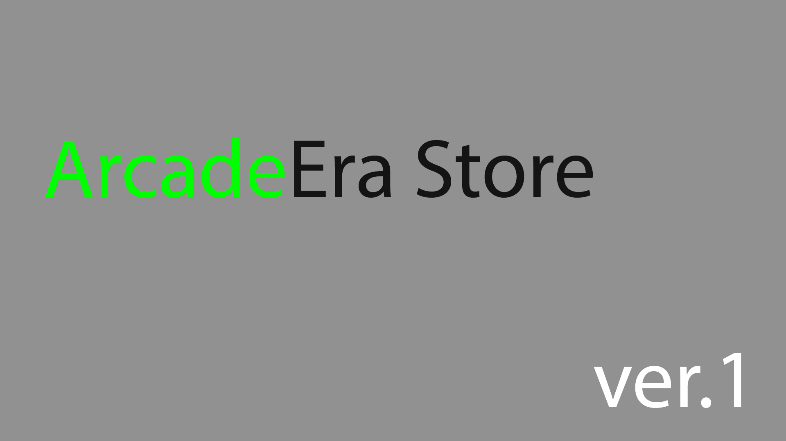

<a name="readme-top"></a>

<!-- PROJECT LOGO -->
<br />
<div align="center">
  <a href="https://github.com/LiveInside/arcade-era">
    
  </a>

<h3 align="center">ArcadeEra Store</h3>
  <p align="center">
    Это лучший магазин игр! :smile:
  </p>
</div>


<!-- TABLE OF CONTENTS -->
<details>
  <summary>Навигация</summary>
  <ol>
    <li><a href="#о-приложении">О приложении</a></li>
      <ul><a href="#описание">Описание</a></ul>
      <ul><a href="#база-данных">База данных</a></ul>
      <ul><a href="#создано-с-помощью">Создано с помощью</a></ul>
    <li><a href="#пример-работы">Пример работы</a></li>
        <ul><a href="#ограничения">Ограничения</a></ul>
    <li><a href="#дорожная-карта">Дорожная карта</a></li>
    <li><a href="#контакты">Контакты</a></li>
  </ol>
</details>


<!-- ABOUT THE PROJECT -->
### О приложении



#### Описание

Данное приложение представляет собой простое CRUD-приложение, которое реализует основные функции (*CREATE, READ, UPDATE, DELETE*).
Реализованные методы:
* `get` - получает сущность по id (*READ*).
* `getAll` - получает все сущности таблицы (*READ*).
* `create` - создаёт сущность (*CREATE*).
* `update` - обновляет сущность по заданному id (*UPDATE*).
* `delete` - удаляет сущность из таблицы по заданному id (*DELETE*).

#### База данных

В качестве базы данных была взята СУБД PostgreSQL. Развёрнута была в контейнере Docker.

С помощью sql-скрипта были созданы и заполнены 3 таблицы, а именно:

* **t_game**
* **t_publisher**
* **t_user**

_Для отслеживания управления и применения изменений в базе данных используется библиотека Liquebase._

#### Создано с помощью
В ходе разработки использовались: 
* База данных - <a href = "https://www.postgresql.org">PostgreSQL</a>
* Расширение фреймворка Spring - <a href = "https://spring.io/">SpringBoot</a>
* База данных была развёрнута с помощью ПО - <a href = "https://www.docker.com/">Docker</a>
* Для миграций была использована - <a href = "https://www.liquibase.com/">Liquebase</a>
* Для описания функционала и предоставления пользовательского интерфейса был использован - <a href = "https://swagger.io/">Swagger</a>

<p align="right">(<a href="#readme-top">back to top</a>)</p>

<!-- GETTING STARTED -->
## Пример работы

_Далее будут более подробно описаны основные методы. Примеры будут показаны на `Game`._

1. Метод `get` - позволяет получить игру по-заданному _id_ из _url_. 
Пример:`/games/1` - в переменную id будет помещён 1.
Возможные результаты:
* В случае успеха (если нужная игра по данному id найдена), игра будет возвращена клиенту в виде json и код 200.
_Пример:_
```json
{
  "id": 1,
  "name": "Apex Legends",
  "platform": "PC",
  "genre": "Battle Royale",
  "price": 0,
  "ageRating": "18+",
  "userEvaluation": 8.9,
  "hide": false
}
```
* Если по данному id нет объекта, то будет возвращена ошибка 404 - сообщающая о том, что объект не найден и соответсвующее сообщение об этом в формате json.
_Пример:_
```json
{
  "status": 404,
  "message": "Игра не найдена"
}
```
2. Метод `getAll` - возвращает все игры, которые существуют в таблице в формате json.

* _Пример если таблица заполнена:_
```json
[
  {
    "id": 1,
    "name": "Apex Legends",
    "platform": "PC",
    "genre": "Battle Royale",
    "price": 0,
    "ageRating": "18+",
    "userEvaluation": 8.9,
    "hide": false
  },
  {
    "id": 2,
    "name": "Counter-Strike: Globale Offensive",
    "platform": "PC",
    "genre": "Team Shooter",
    "price": 11,
    "ageRating": "18+",
    "userEvaluation": 8.3,
    "hide": false
  },
  {
    "id": 3,
    "name": "DOTA 2",
    "platform": "PC",
    "genre": "MOBA",
    "price": 0,
    "ageRating": "18+",
    "userEvaluation": 9,
    "hide": false
  },
  {
    "id": 4,
    "name": "Supreme Commander: Forged Alliance",
    "platform": "PC",
    "genre": "RTS",
    "price": 3.99,
    "ageRating": "18+",
    "userEvaluation": 8.1,
    "hide": true
  },
  {
    "id": 5,
    "name": "Apex Legends",
    "platform": "PC",
    "genre": "Battle Royale",
    "price": 0,
    "ageRating": "18+",
    "userEvaluation": 8.9,
    "hide": false
  }
]
```
* В случае если таблица пустая будет возвращён статус 200 и пустой json.

3. Метод `create` - создаёт(добавляет) по полученному от клиента телу запроса новую игру в таблицу базы данных.
* В случае успеха будет создана новая запись в бд, а клиенту возвращён код 201 и тело игры в формате json.
_Примера тела запроса:_
```json
{
  "name": "Apex Legends",
  "platform": "PC",
  "genre": "Battle Royale",
  "price": 0,
  "ageRating": "18+",
  "userEvaluation": 8.9,
  "hide": false
}
```
_Пример ответа:_
```json
{
  "id": 6,
  "name": "Apex Legends",
  "platform": "PC",
  "genre": "Battle Royale",
  "price": 0,
  "ageRating": "18+",
  "userEvaluation": 8.9,
  "hide": false
}
```
* В случае если данные от клиента не валидны будет возвращён код ошибки 422, название поля или полей в котором данные невалидны и сообщение в формате json.
_Пример запроса в котором удалили поле `name`:_

```json
"platform": "PC",
"genre": "Battle Royale",
"price": 0,
"ageRating": "18+",
"userEvaluation": 8.9,
"hide": false
```
_Пример ответа:_
```json
  {
    "fieldName": "name",
    "message": "Поле не должно быть пустым или состоять из пробелов"
  }
```
4. Метод `update` - обновляет по-заданному id уже существующую игру.
* В случае успеха в базе данных будет обновлена запись по-заданному id на основе переданного клиентом тела. Вернётся код 200 и тело обновлённой игры в формате json.
_Пример запроса `/games/1:_
```json
{
  "price": 10000,
  "userEvaluation": 10,
  "hide": false
}
```
_Пример ответа:_
```json
{
  "id": 1,
  "name": "Apex Legends",
  "platform": "PC",
  "genre": "Battle Royale",
  "price": 10000,
  "ageRating": "18+",
  "userEvaluation": 10,
  "hide": false
}
```
* Если по-данному id игра была не найдена вернётся код ошибки 404 и сообщение в формате json.
_Пример:_
```json
{
  "status": 404,
  "message": "Объект не найден. Обновить не удалось"
}
```
* Если игра, не обновлена, по причине не валидных данных от клиента, то вернётся код ошибки 422, поле в котором содержатся невалидные данные и сообщение в формате json.
_Пример запроса, из которого удалили поле price `/games/1`:_
```json
{
  "userEvaluation": 10,
  "hide": false
}
```
_Пример ответа:_
```json
{
    "fieldName": "price",
    "message": "Поле должно быть заполнено"
}
```
5. Метод `delete` - удаляет игру по-заданному id.
* В случае успешного удаления возвращает код 204, который говорит об успешное удаление так-как по-заданному id нет игры.
* Если игры по-заданному id не было, то также вернётся код 204.

<p align="right">(<a href="#readme-top">back to top</a>)</p>

#### Ограничения
1. Game
   * Метод `create` в теле запроса все поля должны быть заполнены, кроме `id`(генерируется автоматически) и поля `hide`.
   * Метод `update` позволяет обновить только поля `price`, `userEvaluation` и `hide`. Все поля кроме `hide` должны быть заполнены.
   * `id` - не может ровняться 0.
2. Publisher
   * Метод `create` в теле запроса все поля должны быть заполнены, кроме `id`(генерируется автоматически) и поля `hide`.
   * Метод `update` позволяет обновить только поля `country` и `hide`. Все поля кроме `hide` должны быть заполнены.
   * `id` - не может ровняться 0.
3. User
   * Метод `create` в теле запроса все поля должны быть заполнены, кроме `id`(генерируется автоматически).
   * Метод `update` позволяет обновить только поля `balance` и `region` и `name`. 
   * `id` - не может ровняться 0.
   * 
<p align="right">(<a href="#readme-top">back to top</a>)</p>

<!-- ROADMAP -->
## Дорожная карта

- [x] Добавлены базовые методы CRUD-приложения
- [ ] Добавлена возможность скрытия игры и издателя
  - [ ] По регионам
  - [ ] По возрасту пользователя
- [ ] Добавлена регистрация пользователя
<p align="right">(<a href="#readme-top">back to top</a>)</p>

<!-- CONTACT -->
## Контакты

Ссылка на проект: [https://github.com/LiveInside/arcade-era](https://github.com/LiveInside/arcade-era)

<p align="right">(<a href="#readme-top">back to top</a>)</p>